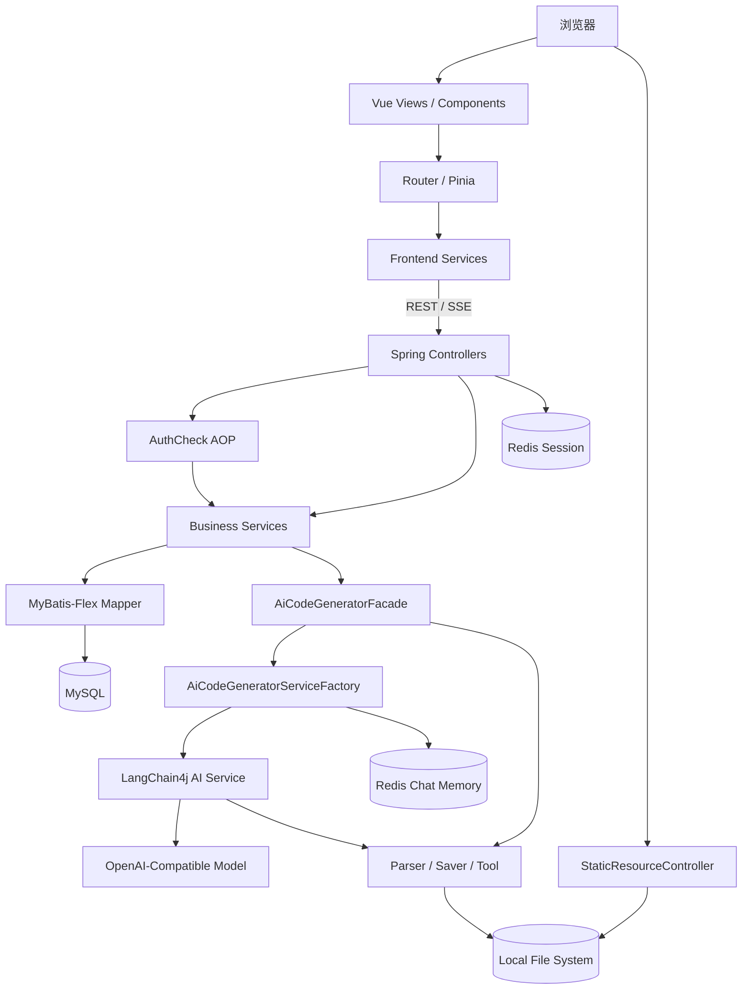

# AI Coding Study 项目完整架构学习指南

> 目标：从零建立对本项目的整体心智模型，理解每个模块的职责、依赖关系、执行流程、设计目的、现实取舍与后续改造方向。
>
> 分析基线：当前分支 `feat/langgraph4j-codegen-workflow` 的工作树（最后核对：2026-07-22）。工作区存在尚未提交的修改，因此本文描述的是“当前可见代码”，不是某个历史发布版本。
>
> 文档结构对应学习路径：
> 1. 前置基础梳理
> 2. 全局整体架构
> 3. 按依赖顺序逐模块深度解析（每模块固定 5 点 + 易踩坑）
> 4. 串联完整业务场景
> 5. 疑问总结与改造路线

---

## 0. 如何使用这份文档

建议按下面顺序学习，不要直接从 Controller 开始逐行读：

1. 先读第 1、2 章，建立业务和架构地图。
2. 按第 3 章给出的依赖顺序学习模块。
3. 每读完一个模块，先回答该模块末尾的检查问题，再继续下一个模块。
4. 最后用第 4 章的完整场景，把所有模块重新串成一条执行链。
5. 使用第 5 章建立自己的改造清单，区分“学习项目的简化设计”和“生产系统必须补齐的能力”。

本文使用以下术语：

- **Entity**：与数据库表映射的持久化实体。
- **DTO/Request**：接口输入模型，只表达客户端可以提交的字段。
- **VO**：接口输出模型，只表达允许返回给客户端的字段。
- **App**：用户在平台内创建的一条 AI 应用记录，不是 Spring 的 `Application`。
- **代码生成类型**：`html`、`multi_file` 或 `vue_project`。
- **普通流**：模型持续输出纯文本 `Flux<String>`。
- **工具流**：模型除了文本，还会产生工具请求、工具执行结果等结构化事件。

---

# 1. 前置基础梳理

## 1.1 项目核心业务目标

这是一个通过自然语言生成网站或前端应用的 AI 应用平台，核心闭环是：

```text
注册/登录
  → 输入应用需求
  → 创建 App 记录
  → 与 AI 持续对话
  → 流式接收代码
  → 保存代码到文件系统
  → 在线预览
  → 部署生成结果
```

围绕主闭环，项目还提供：

- 用户管理和管理员权限。
- 我的应用、精选应用和应用编辑。
- 持久化聊天历史与上下文恢复。
- HTML、多文件 HTML/CSS/JS、Vue 工程三种生成模式。
- AI 工具调用，允许模型主动写入 Vue 项目文件。
- 应用部署、静态资源预览和管理后台。

### 解决的问题

传统前端开发需要需求拆解、项目初始化、编码、调试和部署。该项目尝试让用户用自然语言描述目标，由 AI 完成初版代码生成，并通过多轮对话迭代。

### 适用场景

- AI 编程、LangChain4j、SSE 和工具调用的学习项目。
- 营销页、个人主页、后台页面等原型生成。
- 内部低代码或 AI 应用生成平台的概念验证。
- 演示“模型输出 → 解析 → 文件保存 → 预览”的完整链路。

### 当前不适合直接承担的场景

- 强隔离、多租户的生产 SaaS。
- 需要容灾、弹性扩缩容的分布式部署。
- 允许不可信用户直接执行生成代码的环境。
- 对密码、安全审计、文件隔离、事务一致性有严格要求的系统。

## 1.2 技术栈

### 后端

| 分类 | 技术 | 在项目中的作用 |
|---|---|---|
| 语言 | Java 21 | 后端主体，使用 `switch` 表达式、`List.reversed()` 等新能力 |
| 框架 | Spring Boot 3.5.15 | 依赖管理、自动配置、Bean 容器、内嵌 Web 服务器 |
| Web | Spring MVC | REST、SSE、异常处理和静态资源接口 |
| 响应式 | Reactor `Flux` | 转发 AI 流式输出 |
| AOP | Spring AOP / AspectJ | `@AuthCheck` 权限校验 |
| ORM | MyBatis-Flex 1.11 | CRUD、分页、逻辑删除、查询构造 |
| 数据库 | MySQL + HikariCP | 用户、应用和聊天历史持久化 |
| 会话 | Spring Session Data Redis | 跨进程保存登录 Session |
| AI | LangChain4j 1.1.x | AI Service 动态代理、模型调用、聊天记忆和工具执行 |
| 缓存 | Caffeine | 按 App 和生成类型缓存 AI Service 代理 |
| Redis | Redis Chat Memory Store | 保存模型短期聊天记忆 |
| 文档 | Knife4j / OpenAPI | 接口文档 |
| 工具 | Hutool、Lombok | Bean 复制、文件、字符串、JSON 和样板代码简化 |
| 测试 | JUnit 5、Spring Boot Test | 后端单元及集成测试 |

依赖清单见 [`pom.xml`](../pom.xml)。

### 前端

| 分类 | 技术 | 在项目中的作用 |
|---|---|---|
| 框架 | Vue 3.5 | 页面、组件和响应式状态 |
| 语言 | TypeScript 6 | 客户端契约和静态检查 |
| 构建 | Vite 8 | 开发服务器与生产构建 |
| 状态 | Pinia 3 | 登录用户和登录态初始化 |
| 路由 | Vue Router 5 | 页面导航与前端权限守卫 |
| UI | Ant Design Vue 4 | 表单、表格、消息、弹窗等 |
| HTTP | Axios | 普通 REST 请求 |
| 流式通信 | Browser EventSource | AI SSE 输出 |
| 大整数 | json-bigint | 避免 Java `Long` 在 JavaScript 中丢失精度 |
| 测试 | Vitest | 服务、工具、组件和回归测试 |
| 质量 | vue-tsc、ESLint、Oxlint、Prettier | 类型、Lint 和格式检查 |

依赖清单见 [`ai-coding-front/package.json`](../ai-coding-front/package.json)。

## 1.3 依赖环境

最低运行要求：

- JDK 21。
- Maven 3.9.x。
- Node.js `^20.19.0` 或 `>=22.12.0`。
- npm。
- MySQL，默认数据库名为 `yu_ai_code_mother`。
- Redis，用于 Session 和聊天记忆。
- 一个 OpenAI 协议兼容的聊天模型服务。
- 可写的项目 `tmp/` 目录。

当前机器已检测到：

```text
Java 21.0.10
Maven 3.9.10
Node.js 22.22.3
npm 10.9.8
```

配置分为：

- [`application.yaml`](../src/main/resources/application.yaml)：公共配置，端口、Context Path、Redis、OpenAPI 等。
- `application-local.yaml`：本地 profile 配置，包含数据库和模型连接信息，不应提交或公开凭据。
- `.env`：本地环境变量；当前至少使用模型 API Key。
- `VITE_API_BASE_URL`：可选的前端后端地址覆盖。

当前没有发现 Flyway/Liquibase 或完整建表脚本。新环境启动前必须确认数据库表已创建。

## 1.4 运行入口与启动方式

### 后端入口

[`AiCodingStudyApplication.java`](../src/main/java/com/zlj/aicodingstudy/AiCodingStudyApplication.java)：

```java
@MapperScan("com.zlj.aicodingstudy.mapper") // 扫描 Mapper 接口
@SpringBootApplication(
    exclude = RedisEmbeddingStoreAutoConfiguration.class // 不启用无关的向量库自动配置
)
public class AiCodingStudyApplication {
    public static void main(String[] args) {
        SpringApplication.run(AiCodingStudyApplication.class, args);
    }
}
```

启动命令：

```powershell
mvn spring-boot:run
```

默认地址：

```text
http://localhost:8081/api
```

健康检查：

```text
GET http://localhost:8081/api/health/
```

### 后端启动主流程

```text
JVM 启动 main
  → SpringApplication 创建 ApplicationContext
  → 组件扫描 Controller / Service / Config / Aspect
  → @MapperScan 创建 Mapper 动态代理
  → 读取 application.yaml + application-local.yaml
  → 创建 DataSource / Redis Session / RedisChatMemoryStore
  → 创建 ChatModel / StreamingChatModel
  → 创建 AiCodeGeneratorServiceFactory
  → 创建 Controller 和 AOP 代理
  → 启动内嵌 Tomcat
  → 对外监听 8081，所有接口统一带 /api 前缀
```

注意：`AiCodeGeneratorServiceFactory` 默认会创建一个 `appId=0` 的 AI Service Bean，这可能在启动阶段就触发 Redis 聊天记忆对象创建。

### 前端入口

[`ai-coding-front/src/main.ts`](../ai-coding-front/src/main.ts)：

```ts
const app = createApp(App)
app.use(createPinia()) // 全局状态
app.use(router)        // 路由与导航守卫
app.use(Antd)          // UI 组件库
app.mount('#app')
```

启动命令：

```powershell
cd ai-coding-front
npm install
npm run dev
```

Vite 通常监听 `http://localhost:5173`。前端默认把 API 请求发到当前主机的 `8081/api`。

### 前端启动主流程

```text
浏览器加载 index.html
  → 执行 main.ts
  → 创建 Vue App
  → 注册 Pinia、Router、Ant Design Vue
  → App.vue 渲染 BasicLayout
  → Router 匹配当前 URL
  → beforeEach 判断页面是否需要登录/管理员
  → userStore.fetchLoginUser()
  → GET /user/get/login，携带 Session Cookie
  → 渲染具体 View
```

## 1.5 一级目录分层

| 一级目录 | 核心作用 | 是否属于运行时代码 |
|---|---|---|
| `src/` | Spring Boot 后端源码、配置、Prompt、Mapper XML、测试 | 是 |
| `ai-coding-front/` | Vue 前端独立工程 | 是 |
| `docs/` | 需求、设计和学习文档 | 否 |
| `tmp/` | 生成代码、部署文件、截图和临时审查结果 | 运行时数据 |
| `target/` | Maven 编译、测试和打包产物 | 生成目录 |
| `.agents/` | 项目级 Agent Skill | 开发工具 |
| `.codex/` | Codex 配置与 Hook | 开发工具 |
| `.claude/` | Claude 相关配置 | 开发工具 |
| `.superpowers/` | 规划/头脑风暴记录 | 开发工具 |
| `.code-review-graph/` | 源码知识图谱数据库和可视化 | 开发工具 |
| `.playwright-mcp/` | 浏览器自动化过程文件 | 开发工具 |
| `.idea/` | IntelliJ IDEA 工程配置 | 开发工具 |
| `.git/` | Git 元数据 | 版本管理 |

### `src/main/java/com/zlj/aicodingstudy` 包分层

```text
common / exception / constant       通用协议和基础规则
model                               Entity、DTO、VO、Enum
config                              基础设施 Bean
mapper                              数据访问
service                             业务规则和编排
annotation / aop                    权限横切逻辑
ai                                  模型接口、工厂、消息、工具
core                                代码生成、解析、保存和流处理
controller                          HTTP / SSE / 静态资源入口
```

### `ai-coding-front/src` 分层

```text
types       前后端契约
utils       纯函数、校验、归一化
services    Axios / EventSource 适配
stores      Pinia 全局状态
router      路由表和导航守卫
layouts     页面外壳
components  可复用 UI
views       路由页面和用例编排
__tests__   跨页面与回归测试
```

---

# 2. 全局整体架构

## 2.1 架构性质

项目是一个**前后端分离的分层单体应用**：

- 后端是单个 Spring Boot 进程，不是微服务。
- 前端是独立部署的 Vue SPA。
- 业务主干遵循 Controller → Service → Mapper。
- AI 生成域内部进一步使用 Facade、Factory、Strategy、Template Method。
- AI 输出使用响应式流和 SSE，但项目整体不是事件驱动架构。
- Vue 工程生成使用模型工具调用，具有轻量 Agent/插件特征，但工具集合目前是静态注册的，不是动态插件平台。

## 2.2 整体架构图



## 2.3 依赖方向

理想依赖方向：

```text
Controller
  ↓
Service
  ↓
Mapper
  ↓
Entity / Database
```

AI 生成链：

```text
AppService
  ↓
AiCodeGeneratorFacade
  ↓
AiCodeGeneratorServiceFactory
  ↓
LangChain4j 动态代理
  ↓
ChatModel / StreamingChatModel
```

代码持久化链：

```text
模型文本输出
  ↓
CodeParserExecutor
  ↓
HtmlCodeParser / MultiFileCodeParser
  ↓
CodeFileSaverExecutor
  ↓
CodeFileSaverTemplate 子类
  ↓
tmp/code_output/{type}_{appId}
```

工具调用链：

```text
模型产生 writeFile 请求
  ↓
LangChain4j Tool Executor
  ↓
FileWriteTool.writeFile
  ↓
tmp/code_output/vue_project_{appId}
```

## 2.4 主要数据流

| 数据 | 入口 | 传输 | 后端处理 | 最终去向 |
|---|---|---|---|---|
| 登录信息 | LoginView | Axios POST | UserController → UserService | Redis Session |
| App 元数据 | HomeView / 管理页 | Axios REST | AppController → AppService | MySQL `app` |
| 聊天历史 | AppChatView | REST + SSE | AppService / ChatHistoryService | MySQL `chat_history` |
| AI 上下文 | AI Service Factory | 内部调用 | MessageWindowChatMemory | Redis Chat Memory |
| AI 文本 | LLM | Token/Flux | Facade → SSE | 浏览器 + 本地文件 |
| 工具事件 | LLM | TokenStream | Tool → JSON Message | 浏览器 + 本地文件 |
| 预览文件 | AppChatView iframe | HTTP GET | StaticResourceController | `tmp/code_output` |
| 部署文件 | 部署按钮 | Axios POST | AppService.deployApp | `tmp/code_deploy` |

需要特别理解：MySQL 聊天历史与 Redis Chat Memory 是两套状态。MySQL 是长期记录，Redis 是模型运行时上下文；Factory 创建新 AI Service 时会从 MySQL 恢复最近消息到 Redis Memory。

## 2.5 核心设计模式与取舍

### 分层单体

**理由**：业务规模有限，用户、应用、AI、部署存在紧密调用关系，一个进程便于调试和部署。

**对比微服务**：

- 优点：没有服务发现、分布式事务、链路追踪和多仓库成本。
- 缺点：AI 高耗时任务会与普通 CRUD 共享资源；无法独立扩容 AI Worker。

### Facade（门面）

`AiCodeGeneratorFacade` 为上层提供统一的“生成并保存”接口，隐藏模型选择、流转换、解析和保存。

- 优点：Controller/Service 不需要了解每一种生成类型。
- 缺点：当前 Facade 同时负责模型分发、流桥接和文件保存，职责开始变重。

### Factory + Cache

`AiCodeGeneratorServiceFactory` 按 `appId + codeGenType` 创建和缓存 LangChain4j 动态代理。

- 优点：每个 App 拥有独立聊天记忆，避免反复创建代理。
- 缺点：本地 Caffeine 缓存不是多实例共享状态；每个实例都可能持有自己的代理。

### Strategy（策略）

`CodeParser<T>` 将不同输出格式的解析算法分开。

- 优点：解析规则可独立测试。
- 缺点：Executor 仍用 `switch` 和静态实例，新增类型需要同时修改多处。

### Template Method（模板方法）

`CodeFileSaverTemplate.saveCode()` 固定“校验 → 建目录 → 保存 → 返回目录”的流程，子类只决定具体文件。

- 优点：公共步骤不会在每个保存器中重复。
- 缺点：只适合流程稳定的文件型输出；Vue 工具写入走了另一套链路。

### AOP 鉴权

`@AuthCheck` + `AuthInterceptor` 把管理员校验从 Controller 中抽离。

- 优点：声明式、代码少。
- 缺点：只支持非常简单的角色判断；资源所有权仍散落在业务代码中。

### SSE

AI 输出是服务端单向流，SSE 比 WebSocket 更简单，浏览器原生支持自动连接和事件类型。

- 优点：基于 HTTP、实现成本低、适合 token 流。
- 缺点：EventSource 主要使用 GET，Prompt 会进入 URL；难以添加自定义认证 Header；双向交互能力有限。

### MyBatis-Flex

- 优点：CRUD、分页和 QueryWrapper 简洁，SQL 思维直接。
- 缺点：动态排序字段需要显式白名单；复杂领域规则和聚合一致性需要业务层自行维护。

### 本地文件系统

- 优点：生成后即可预览，开发环境非常直接。
- 缺点：多实例不共享、缺乏配额和隔离、容易受到路径穿越影响，生产环境通常应改用隔离 Worker + 对象存储。

## 2.6 当前架构的“目标形态”和“实际接线”

当前分支存在几处明显的演进中状态：

1. `StreamHandlerExecutor`、`SimpleTextStreamHandler`、`JsonMessageStreamHandler` 已实现，但没有外部调用点。
2. `AppServiceImpl` 仍直接收集 Facade 返回的原始 `Flux<String>`。
3. Vue 工具流在 Facade 中被转成 JSON 字符串，但未经过 `JsonMessageStreamHandler` 转成用户可读文本。
4. `codegen-routing-system-prompt.txt` 已存在，但创建 App 时仍硬编码 `multi_file`。
5. `src/main/java/dev/langchain4j` 直接覆盖同包框架类，为工具调用增量事件打补丁。

学习时要区分：

- **现状**：现在代码真正调用了什么。
- **设计意图**：新增 Handler、路由 Prompt 和框架补丁想把系统带到哪里。

---

# 3. 按依赖顺序逐模块深度解析

## 模块 1：公共协议、异常与基础常量

路径：`common/`、`exception/`、`constant/`

### ① 模块定位

这是所有后端模块共享的基础语言：定义统一响应、错误码、业务异常、分页参数、删除参数和全局常量。

### ② 内部子划分

| 文件 | 职责 |
|---|---|
| `BaseResponse<T>` | REST 响应 `{code,data,message}` |
| `ResultUtils` | 快速创建成功/失败响应 |
| `PageRequest` | 页码、页大小、排序字段、排序方向 |
| `DeleteRequest` | 统一删除 ID 请求 |
| `ErrorCode` | 业务错误码枚举 |
| `BusinessException` | 携带业务错误码的运行时异常 |
| `ThrowUtils` | 条件满足时抛业务异常 |
| `GlobalExceptionHandler` | 统一处理普通 REST 和 SSE 异常 |
| `UserConstant` | Session Key、用户/管理员角色 |
| `AppConstant` | 精选优先级、输出/部署目录、部署 Host |

### ③ 核心类/核心函数

[`ResultUtils.success`](../src/main/java/com/zlj/aicodingstudy/common/ResultUtils.java)：

```java
public static <T> BaseResponse<T> success(T data) {
    return new BaseResponse<>(0, data, "ok");
}
```

- 入参：任意业务结果 `T`。
- 出参：统一成功响应。
- 逻辑：业务成功永远使用 `code=0`。

[`ThrowUtils.throwIf`](../src/main/java/com/zlj/aicodingstudy/exception/ThrowUtils.java)：

```java
public static void throwIf(boolean condition, ErrorCode code, String message) {
    throwIf(condition, new BusinessException(code, message));
}
```

- 入参：失败条件、错误码、自定义消息。
- 出参：无。
- 逻辑：条件为真时中断当前调用链。

[`GlobalExceptionHandler`](../src/main/java/com/zlj/aicodingstudy/exception/GlobalExceptionHandler.java) 有两种输出：

```text
普通请求：BaseResponse(code, null, message)

SSE 请求：
event: business-error
data: {"error":true,"code":...,"message":"..."}

event: done
data: {}
```

### ④ 执行流程

```text
正常：Controller → ResultUtils.success → Jackson → JSON → 前端

业务失败：Service → ThrowUtils → BusinessException
                    → GlobalExceptionHandler
                    → BaseResponse 或 SSE error event
```

### ⑤ 设计思考

如果没有统一协议，每个 Controller 都会自行决定成功、失败和分页格式，前端需要为每个接口写不同解析逻辑。统一协议降低了接口协作成本。

代价是业务错误码和 HTTP 状态码被分成两套语义；当前多数业务失败仍可能返回 HTTP 200。

### 易踩坑、难点与改造方向

- `ResultUtils.success` 与 `ErrorCode.SUCCESS` 重复定义成功语义。
- `PageRequest.sortField` 来自客户端，后端必须做白名单校验。
- `PageRequest.pageSize` 没有统一上限。
- SSE 检测依赖 Header 或 URL 字符串，协议知识进入全局异常层。
- Controller 自己也有 `onErrorResume`，与全局 SSE 异常处理重复。
- 可改为：REST 使用 `ProblemDetail/ResponseEntity`，SSE 使用独立 `StreamErrorEncoder`。

检查问题：为什么前端不能只看 HTTP 200 判断业务成功？

---

## 模块 2：领域模型与接口契约

路径：`model/entity`、`model/dto`、`model/vo`、`model/enums`

### ① 模块定位

该模块定义项目中的核心名词以及不同边界上的数据形状，是数据库、业务层和前端之间的契约中心。

### ② 内部子划分

#### Entity

- `User`：账号、密码摘要、昵称、头像、简介、角色、逻辑删除。
- `App`：应用名称、初始 Prompt、生成类型、部署 Key、优先级、创建者。
- `ChatHistory`：消息、消息类型、App、用户、创建时间。

#### DTO

- 用户：注册、登录、新增、更新、查询。
- 应用：新增、更新、管理员更新、部署、查询。
- 聊天：查询和游标时间。

#### VO

- `LoginUserVO`：当前登录用户的脱敏信息。
- `UserVO`：对外用户信息。
- `AppVO`：App 信息及关联创建者 `UserVO`。

#### Enum

- `UserRoleEnum`：`user`、`admin`。
- `CodeGenTypeEnum`：`html`、`multi_file`、`vue_project`。
- `ChatHistoryMessageTypeEnum`：`user`、`ai`。

### ③ 核心类/核心函数

`CodeGenTypeEnum.getEnumByValue(value)`：

```text
输入 "multi_file"
  → 遍历枚举值
  → 返回 CodeGenTypeEnum.MULTI_FILE
输入未知值
  → 返回 null
```

Entity → VO：

```java
UserVO vo = new UserVO();
BeanUtil.copyProperties(user, vo);
```

关键点不是 Bean 复制本身，而是 VO 根本没有 `userPassword` 字段，因此默认不会把密码摘要返回给普通接口。

### ④ 执行流程

```text
JSON Request
  → DTO
  → Controller 校验
  → Entity
  → Service / Mapper
  → Entity
  → VO
  → BaseResponse
  → JSON
```

前端统一把所有 ID 建模成 `string`，避免 Java `Long` 超过 JavaScript 安全整数范围。

### ⑤ 设计思考

Entity、DTO、VO 分离是边界保护：数据库字段变化不应直接改变接口；客户端也不应通过提交完整 Entity 修改密码、角色、所有者等敏感字段。

不分离的后果包括：过度提交、敏感字段泄露、数据库结构和前端强耦合。

### 易踩坑、难点与改造方向

- 多数 DTO 缺少 `jakarta.validation` 注解，校验散落在 Controller/Service。
- `BeanUtil.copyProperties` 依赖同名字段，重命名后可能静默丢字段。
- `getEnumByValue` 返回 `null`，每个调用者都必须防御。
- Entity 直接使用字符串保存枚举，数据库可能出现非法值。
- 可引入 MapStruct、Bean Validation 和数据库约束。

检查问题：为什么管理员更新 App 和普通用户更新 App 要使用两个不同 DTO？

---

## 模块 3：运行配置与基础设施

路径：`config/`、`src/main/resources/application*.yaml`

### ① 模块定位

把数据库、Redis、JSON、CORS、模型客户端等外部能力构造成 Spring Bean，供业务模块依赖。

### ② 内部子划分

| 配置 | 职责 |
|---|---|
| `CorsConfig` | 允许跨域并携带 Cookie |
| `JsonConfig` | 把 Java `Long` 序列化为字符串 |
| `RedisChatMemoryStoreConfig` | 创建 LangChain4j Redis Chat Memory Store |
| `ReasoningStreamingChatModelConfig` | 创建用于 Vue 工具调用的推理流模型 |
| `application.yaml` | 通用 Spring、Session、Redis、端口和 OpenAPI 配置 |
| `application-local.yaml` | 本地数据库和模型配置 |

### ③ 核心类/核心函数

[`JsonConfig`](../src/main/java/com/zlj/aicodingstudy/config/JsonConfig.java)：

```java
module.addSerializer(Long.class, ToStringSerializer.instance);
module.addSerializer(Long.TYPE, ToStringSerializer.instance);
```

它解决 `Long` 在浏览器中的精度问题，因此前端类型把 ID 统一声明成字符串。

`ReasoningStreamingChatModelConfig`：

```text
读取 baseUrl + apiKey
  → OpenAiStreamingChatModel.builder()
  → 设置推理模型、最大 Token、日志选项
  → 注册 reasoningStreamingChatModel Bean
```

### ④ 执行流程

```text
Spring 启动
  → 读取配置属性
  → 实例化 Config 类
  → 执行 @Bean 方法
  → Bean 注入 Factory / Service
```

### ⑤ 设计思考

配置模块把“如何连接外部系统”与“业务要做什么”分开。业务代码依赖 `ChatModel`、`RedisChatMemoryStore` 等接口，而不是自己读取环境变量和创建连接。

### 易踩坑、难点与改造方向

- `CorsConfig` 使用 `allowedOriginPatterns("*")` 且允许 Cookie，只适合开发环境。
- 推理模型名称、Token 数和日志开关部分硬编码，可能覆盖 YAML 预期。
- 请求/响应日志可能包含 Prompt 或生成代码，生产环境应关闭或脱敏。
- Redis 同时承担 Session 和 AI Memory，容量与 TTL 需要分别规划。
- 本地配置包含敏感凭据，必须保持忽略并定期轮换。

检查问题：为什么后端序列化 Long 为字符串后，前端仍保留 `json-bigint` 和归一化函数？

---

## 模块 4：持久化层

路径：`mapper/`、`resources/mapper/`

### ① 模块定位

将 User、App、ChatHistory 的 CRUD 和查询映射到 MySQL。

### ② 内部子划分

- `UserMapper extends BaseMapper<User>`。
- `AppMapper extends BaseMapper<App>`。
- `ChatHistoryMapper extends BaseMapper<ChatHistory>`。
- 三个 XML 目前只有 namespace，没有自定义 SQL。

### ③ 核心类/核心函数

Mapper 本身几乎没有代码，能力来自 MyBatis-Flex：

```text
selectOneByQuery
selectCountByQuery
insert / updateById / removeById
page(Page, QueryWrapper)
```

查询由 Service 中的 `getQueryWrapper()` 构造，例如：

```java
QueryWrapper.create()
    .eq("userRole", userRole)
    .like("userName", userName)
    .orderBy(sortField, ascending);
```

### ④ 执行流程

```text
Service 方法
  → Mapper 动态代理
  → MyBatis-Flex 生成 SQL
  → Hikari 获取连接
  → MySQL
  → ResultSet 映射 Entity
```

### ⑤ 设计思考

当前 Mapper 保持“薄”，简单 CRUD 全部交给框架，减少 XML 和样板代码。复杂查询出现后，再把稳定、可复用的 SQL 下沉到 Mapper/XML。

### 易踩坑、难点与改造方向

- 动态 `sortField` 必须由后端白名单控制，不能只依赖前端 TypeScript 联合类型。
- 缺少数据库迁移脚本，环境难以复现。
- 逻辑删除、索引、唯一约束必须与数据库结构一致。
- App、ChatHistory 常按 `userId/appId/createTime` 查询，应建立组合索引。
- 可补充 Testcontainers + MySQL 集成测试。

检查问题：为什么前端限制排序字段不能替代后端排序白名单？

---

## 模块 5：用户与 Session 业务

路径：`service/UserService.java`、`service/impl/UserServiceImpl.java`

### ① 模块定位

负责注册、登录、登出、当前用户查询、用户脱敏和用户查询条件。

### ② 内部子划分

- `UserService`：业务接口。
- `UserServiceImpl`：规则实现，同时继承 MyBatis-Flex `ServiceImpl` 获得 CRUD。

### ③ 核心类/核心函数

[`userRegister`](../src/main/java/com/zlj/aicodingstudy/service/impl/UserServiceImpl.java)：

```text
校验账号/密码
  → 查询账号是否存在
  → 密码加盐 MD5
  → 创建 User，默认 role=user
  → 写入数据库
  → 返回 userId
```

[`userLogin`](../src/main/java/com/zlj/aicodingstudy/service/impl/UserServiceImpl.java)：

```text
校验参数
  → 对输入密码做相同摘要
  → 按 account + password 查询
  → request.getSession().setAttribute("user_login", user)
  → 返回 LoginUserVO
```

[`getLoginUser`](../src/main/java/com/zlj/aicodingstudy/service/impl/UserServiceImpl.java)：

```text
从 Session 取 User
  → 没有 ID：抛 NOT_LOGIN
  → 按 ID 重新查数据库
  → 用户不存在：抛 NOT_LOGIN
  → 返回最新 User
```

### ④ 执行流程

```text
LoginView
  → POST /user/login
  → UserController
  → UserService.userLogin
  → MySQL 查询
  → Spring Session 写 Redis
  → Set-Cookie
  → 前端 userStore 保存 LoginUserVO
```

后续请求通过 Axios `withCredentials=true` 或 EventSource `withCredentials=true` 自动携带 Cookie。

### ⑤ 设计思考

服务端 Session 对浏览器简单，前端不需要保存 Token，也降低 XSS 直接读取凭据的风险。Redis Session 允许未来多个后端实例共享登录态。

### 易踩坑、难点与改造方向

- 固定盐 MD5 不适合密码存储，应使用 BCrypt/Argon2。
- Session 中保存完整 User，包含密码摘要和可能过期的数据。
- 每次 `getLoginUser` 都查数据库，正确性更高但增加读压力。
- 注册的“先 count 后 insert”存在并发窗口，数据库必须有唯一索引。
- 登出只移除属性，可考虑使整个 Session 失效。

检查问题：为什么即使注册前查了重复账号，数据库仍需要唯一约束？

---

## 模块 6：注解鉴权与 AOP

路径：`annotation/AuthCheck.java`、`aop/AuthInterceptor.java`

### ① 模块定位

为管理员接口提供声明式角色校验，并复用 UserService 的 Session 登录判断。

### ② 内部子划分

- `@AuthCheck(mustRole = "...")`：方法级注解。
- `AuthInterceptor`：环绕通知，执行登录和角色判断。

### ③ 核心类/核心函数

```java
@Around("@annotation(authCheck)")
public Object doInterceptor(ProceedingJoinPoint point, AuthCheck authCheck) {
    User loginUser = userService.getLoginUser(request);
    UserRoleEnum required = UserRoleEnum.getEnumByValue(authCheck.mustRole());
    // 无角色：只要求登录
    // admin：要求实际角色也是 admin
    return point.proceed();
}
```

入参是被拦截的方法调用和注解；出参是原方法结果；失败时抛 `BusinessException`。

### ④ 执行流程

```text
请求到达带 @AuthCheck 的 Controller 方法
  → Spring AOP Proxy
  → AuthInterceptor.doInterceptor
  → UserService.getLoginUser
  → 角色校验
  → joinPoint.proceed
  → Controller 真正执行
```

### ⑤ 设计思考

管理员校验是横切关注点，抽到 AOP 后 Controller 只声明“需要什么角色”。如果每个接口手写 Session/角色判断，容易漏检和产生不同错误行为。

### 易踩坑、难点与改造方向

- 当前只真正实现“管理员/非管理员”判断，不是通用 RBAC。
- 只有标注注解的方法才受保护，漏标就可能暴露接口。
- App 所有权仍需业务层判断，不能仅靠角色 AOP。
- 可迁移到 Spring Security Method Security，并建立统一认证主体。

检查问题：为什么 `@AuthCheck(admin)` 不能替代“当前用户是不是 App 创建者”的检查？

---

## 模块 7：App 与聊天历史业务

路径：`AppServiceImpl.java`、`ChatHistoryServiceImpl.java`

### ① 模块定位

这是平台的业务编排中心：维护 App 生命周期、所有权、聊天历史、AI 调用、预览文件和部署文件之间的关系。

### ② 内部子划分

#### AppServiceImpl

- App CRUD 和 VO 组装。
- 查询条件构建。
- `chatToGenCode`：生成主流程。
- `deployApp`：文件复制和部署信息更新。
- 删除 App 时清理历史。

#### ChatHistoryServiceImpl

- 保存用户/AI 消息。
- 按 App 删除消息。
- 创建者/管理员查询历史。
- 基于 `createTime` 游标分页。
- 把 MySQL 历史恢复为 LangChain4j ChatMemory。

### ③ 核心类/核心函数

[`AppServiceImpl.chatToGenCode`](../src/main/java/com/zlj/aicodingstudy/service/impl/AppServiceImpl.java)：

```text
校验 appId/message
  → 查询 App
  → 校验 loginUser 是创建者
  → codeGenType 字符串转枚举
  → 保存用户消息
  → Facade.generateAndSaveCodeStream
  → 向客户端转发 chunk
  → 流完成后保存 AI 完整响应
  → 流失败后保存错误消息
```

[`deployApp`](../src/main/java/com/zlj/aicodingstudy/service/impl/AppServiceImpl.java)：

```text
校验 App 和所有权
  → 生成/复用 deployKey
  → 定位 tmp/code_output/{type}_{appId}
  → 复制到 tmp/code_deploy/{deployKey}
  → 更新 deployKey/deployedTime
  → 返回部署 URL
```

[`loadChatHistoryToMemory`](../src/main/java/com/zlj/aicodingstudy/service/impl/ChatHistoryServiceImpl.java)：

```text
倒序查询最近 N 条
  → reversed() 恢复时间正序
  → clear Redis ChatMemory
  → user 转 UserMessage
  → ai 转 AiMessage
  → 写入 Memory
```

### ④ 执行流程

输入来自 Controller；App/历史数据经 Mapper 进入 MySQL；AI 请求进入 Facade；最终 Flux 返回 Controller。

聊天存在两个时间点：

1. 调用模型前，用户消息立即落库。
2. 模型正常完成后，聚合后的 AI 消息落库。

### ⑤ 设计思考

把聊天记录、所有权、AI 调用放在 Service 而不是 Controller，可以让 HTTP 只负责协议适配。ChatHistory 单独成模块，是因为它既服务页面查询，也服务模型上下文恢复。

### 易踩坑、难点与改造方向

- 生成、历史写入、文件保存不是一个事务，可能出现部分成功。
- 删除 App 时历史删除失败只记日志，仍继续删 App，可能留下孤儿记录。
- `getAppVOList` 先批量查用户，但内部仍调用会单查用户的 `getAppVO`，N+1 并未彻底消除。
- 普通分页限制 20，管理员接口未统一限制。
- AI 完整响应可能很大，直接存单个 text 字段需评估容量。
- 可引入 Outbox/Job 状态，把生成任务建模为独立实体。

检查问题：模型已经把内容发给浏览器，但文件保存失败时，系统应该把本次生成标记成什么状态？

---

## 模块 8：AI Service、Prompt、记忆与工具

路径：`ai/`、`resources/prompt/`

### ① 模块定位

把业务层的“请生成代码”翻译成模型请求，并把模型响应、聊天记忆和工具执行暴露为 Java 接口。

### ② 内部子划分

| 子模块 | 职责 |
|---|---|
| `AiCodeGeneratorService` | 声明式 AI 接口 |
| `AiCodeGeneratorServiceFactory` | 创建、配置、缓存动态代理 |
| `ai/model` | HTML、多文件结构化结果 |
| `ai/message` | 文本、工具请求、工具完成等流消息 |
| `ai/tools` | 模型可调用工具：`BaseTool` 抽象展示文案，`FileWriteTool` 实际写文件 |
| `resources/prompt` | HTML、多文件、Vue、路由、图片、质量检查 Prompt |

### ③ 核心类/核心函数

[`AiCodeGeneratorService`](../src/main/java/com/zlj/aicodingstudy/ai/AiCodeGeneratorService.java)：

```java
@SystemMessage(fromResource = "prompt/codegen-multi-file-system-prompt.txt")
Flux<String> generateMultiFileCodeStream(String userMessage);

@SystemMessage(fromResource = "prompt/codegen-vue-project-system-prompt.txt")
TokenStream generateVueProjectCodeStream(
    @MemoryId long appId,
    @UserMessage String userMessage
);
```

接口没有手写实现；LangChain4j 在运行时生成代理。

[`AiCodeGeneratorServiceFactory`](../src/main/java/com/zlj/aicodingstudy/ai/AiCodeGeneratorServiceFactory.java)：

```text
cacheKey = appId + codeGenType
  → Cache 命中：复用代理
  → 未命中：创建 MessageWindowChatMemory(max=20)
  → 从 MySQL 恢复历史
  → HTML/MULTI_FILE：普通 streaming model
  → VUE_PROJECT：reasoning model + FileWriteTool
```

[`FileWriteTool.writeFile`](../src/main/java/com/zlj/aicodingstudy/ai/tools/FileWriteTool.java)：

```text
输入 relativeFilePath/content/appId
  → 计算 vue_project_{appId} 根目录
  → 创建父目录
  → 覆盖写入文件
  → 返回相对路径成功消息
```

### ④ 执行流程

```text
Facade 调 AI Service 接口
  → LangChain4j Proxy 读取 @SystemMessage
  → 拼接聊天记忆和用户消息
  → 调用模型
  → 普通文本 Flux 或 TokenStream
  → 工具请求时执行 FileWriteTool
```

### ⑤ 设计思考

声明式 AI Service 让 Prompt、Memory 和 Java 方法绑定，业务层不需要手工构造 OpenAI 请求。Factory 让不同 App 的上下文隔离，并按生成类型选择模型能力。

### 易踩坑、难点与改造方向

- `new FileWriteTool()` 绕过 Spring 注入；后续工具有依赖时会出问题。
- 文件工具允许绝对路径，且相对路径没有 `normalize + startsWith(root)` 校验，存在越界写文件风险。
- Prompt 是运行时代码的一部分，应版本化并建立回归测试。
- Caffeine Cache 只在单进程有效。
- MySQL History 与 Redis Memory 需要明确一致性策略。
- 可建立 Tool Registry、Prompt Version 和 App Generation Run 实体。

检查问题：为什么 AI Service 的缓存键必须同时包含 `appId` 和 `codeGenType`？

---

## 模块 9：本地 LangChain4j 流式补丁

路径：`src/main/java/dev/langchain4j/`

### ① 模块定位

该目录不是普通业务包，而是在项目源码中使用与第三方依赖相同的包名和类名，扩展流式工具调用事件。

### ② 内部子划分

- `TokenStream`：增加部分工具请求和工具执行回调。
- `AiServiceTokenStream`：保存回调并启动流。
- `AiServiceStreamingResponseHandler`：处理递归工具调用和模型响应。
- `StreamingChatModel` / `StreamingChatResponseHandler`：向模型层传播工具增量事件。
- `OpenAiStreamingChatModel`：解析 OpenAI 流式工具 Delta。
- `OpenAiStreamingResponseBuilder`：聚合最终响应。
- `ToolExecutionRequestBuilder`：按工具索引拼接 ID、名称和参数。

### ③ 核心类/核心函数

```java
TokenStream
  .onPartialResponse(textHandler)
  .onPartialToolExecutionRequest(toolDeltaHandler)
  .onToolExecuted(toolResultHandler)
  .onCompleteResponse(doneHandler)
  .onError(errorHandler)
  .start();
```

模型流中的工具参数可能被拆成很多 Delta，Builder 必须按 `index` 聚合，直到形成完整工具请求。

### ④ 执行流程

```text
OpenAI 流式响应
  → OpenAiStreamingChatModel.handle
  → partial text / partial tool callback
  → AiServiceStreamingResponseHandler
  → 执行 Tool
  → tool executed callback
  → 把工具结果加入 Memory
  → 再次请求模型
  → 最终 complete
```

### ⑤ 设计思考

项目需要在工具参数尚未全部生成时就向前端反馈“正在选择/调用工具”，而当前依赖版本的公开 API 不完全满足需求，因此直接补丁框架类。

### 易踩坑、难点与改造方向

- 同包同类覆盖对依赖版本极其敏感，升级 LangChain4j 可能出现二进制不兼容。
- 复制第三方源码会带来许可证、漏洞修复和维护成本。
- 部分类仍带上游 TODO，说明 API 尚未稳定。
- 应优先贡献上游、维护正式 fork，或在适配层组合而非覆盖框架 FQCN。
- 必须有针对多工具、分片参数、递归调用、异常和取消的协议测试。

检查问题：直接把第三方类复制进项目源码，和维护一个独立 fork 相比，最大的升级风险是什么？

---

## 模块 10：代码生成核心管线

路径：`core/`、`core/parser/`、`core/saver/`、`core/handler/`

### ① 模块定位

连接 AI 输出与文件系统，是“模型返回文本”变成“可预览项目”的核心模块。

### ② 内部子划分

- `AiCodeGeneratorFacade`：统一编排入口。
- `parser`：从 Markdown 代码块解析结构化结果。
- `saver`：按固定流程创建并写入文件。
- `handler`：设计上把普通流/工具 JSON 流转换为用户可读文本并记录历史。
  - `StreamHandlerExecutor`：按 `CodeGenTypeEnum` 分发。
  - `SimpleTextStreamHandler`：HTML / MULTI_FILE。
  - `JsonMessageStreamHandler`：VUE_PROJECT。
  - **当前状态：三者均已实现，但业务调用链尚未接入**（`AppServiceImpl` 仍直接收集原始 `Flux`）。
- 根目录旧版 `CodeParser`、`CodeFileSaver`：早期实现，与新 parser/saver 并存。

### ③ 核心类/核心函数

[`AiCodeGeneratorFacade.generateAndSaveCodeStream`](../src/main/java/com/zlj/aicodingstudy/core/AiCodeGeneratorFacade.java)：

```text
HTML
  → generateHtmlCodeStream
  → processCodeStream(HTML)

MULTI_FILE
  → generateMultiFileCodeStream
  → processCodeStream(MULTI_FILE)

VUE_PROJECT
  → generateVueProjectCodeStream
  → processTokenStream
```

`processCodeStream`：

```text
每个 chunk：原样下发，同时追加 StringBuilder
流完成：ParserExecutor → SaverExecutor
解析/保存失败：只记日志，不让已完成的客户端流失败
```

`CodeParserExecutor` 使用策略分发：

```java
return switch (codeGenType) {
    case HTML -> htmlCodeParser.parseCode(content);
    case MULTI_FILE -> multiFileCodeParser.parseCode(content);
    default -> throw ...;
};
```

`CodeFileSaverTemplate.saveCode` 使用模板方法：

```text
validateInput
  → buildUniqueDir(type_appId)
  → saveFiles
  → return File
```

### ④ 执行流程

```text
AI Flux
  → Facade 向下游转发
  → Controller 包装 SSE
  → 浏览器实时展示

同一个 Flux 完成
  → Facade 聚合完整文本
  → Parser 解析 Markdown 代码块
  → Saver 写 index.html/style.css/script.js
```

Vue 工程不同：文件在工具执行阶段逐个写入，不经过 Parser/Saver。

### ⑤ 设计思考

Facade 把多步骤工作流封装成单个入口；Parser 与 Saver 分离后，可以独立更换输出格式或存储方式；模板方法保证不同 Saver 共享一致目录规则。

### 易踩坑、难点与改造方向

- 正则解析 Markdown 对模型格式偏差敏感。
- `Object` + 强制类型转换削弱编译期类型安全。
- 保存失败被吞掉，客户端仍收到 `done`，会误以为生成成功。
- HTML/MULTI_FILE 和 VUE_PROJECT 走两套保存架构。
- Handler 模块当前尚未接入，Vue 原始 JSON 可能直接进入上层历史/展示。
- 旧版和新版 Parser/Saver 并存，应确认无调用后删除旧实现。
- 可改成 `GenerationStrategy` 注册表，每个类型统一定义模型、流转换、保存和预览策略。

检查问题：为什么“流输出成功”不能等价于“代码文件保存成功”？

---

## 模块 11：Controller、SSE 和静态资源

路径：`controller/`

### ① 模块定位

把 HTTP 请求转换成业务调用，并把业务结果转换为 JSON、SSE 或文件响应。

### ② 内部子划分

| Controller | 职责 |
|---|---|
| `HealthController` | 健康检查 |
| `UserController` | 注册、登录、用户管理 |
| `AppController` | App CRUD、生成、部署、精选和管理 |
| `ChatHistoryController` | 创建者历史游标查询、管理员分页查询 |
| `StaticResourceController` | 读取 `tmp/code_output` 供 iframe 预览 |

### ③ 核心类/核心函数

[`AppController.chatToGenCode`](../src/main/java/com/zlj/aicodingstudy/controller/AppController.java)：

```text
校验 appId/message
  → getLoginUser
  → appService.chatToGenCode
  → 每个 chunk 包成 {"d":"..."}
  → SSE 默认 message event
  → error 时发 business-error
  → 最后发 done
```

当前应用创建：

```java
app.setAppName(initPrompt 前 12 位);
app.setCodeGenType(CodeGenTypeEnum.MULTI_FILE.getValue());
```

说明路由 Prompt 尚未接入，所有新 App 默认都是 `multi_file`。

`StaticResourceController`：

```text
GET /static/{deployKey}/**
  → 路径参数名虽叫 deployKey，实际用于预览目录名：{codeGenType}_{appId}
  → 拼接 tmp/code_output/{deployKey}/...
  → 空路径 301 到带斜杠 URL
  → 根路径默认 index.html
  → 根据扩展名设置 Content-Type
  → 注意：当前是字符串拼接，未做 normalize / 根目录包含校验
```

### ④ 执行流程

```text
HTTP
  → Spring 参数绑定
  → Controller 校验
  → 可选 AOP
  → Service
  → ResultUtils / ServerSentEvent / ResponseEntity<Resource>
```

### ⑤ 设计思考

Controller 保持协议层定位，复杂业务交给 Service。SSE 由 Controller 统一包裹 `{d: chunk}`，使前端解析格式固定。

### 易踩坑、难点与改造方向

- SSE 使用 GET，Prompt 出现在 URL、日志和浏览器历史中。
- Controller 的 `onErrorResume` 把所有异常都改成 `50000`，会丢失原业务码。
- `concatWith(done)` 让错误后也发送 done，前端必须保证 error 后不再按成功处理。
- 静态资源路径直接字符串拼接，需要防止 `../` 路径穿越。
- 预览读取 `code_output`，部署复制到 `code_deploy`；当前应用没有负责服务 `code_deploy` 的 Controller。
- 返回的部署 URL 未体现端口、Context Path 或 `/static`，隐含外部 Nginx/静态服务器假设，但仓库未说明。
- `UserController.getUserById` 返回完整 User，应严格限制且最好永不返回密码摘要。

检查问题：为什么静态文件 Controller 必须先 `normalize` 路径并验证它仍位于允许的根目录？

---

## 模块 12：前端类型、HTTP、SSE 与工具函数

路径：`types/`、`services/`、`utils/`

### ① 模块定位

这是浏览器与后端之间的适配层：定义前端契约、统一 REST 错误、归一化大整数 ID、管理 EventSource 生命周期，并提供可测试的纯函数。

### ② 内部子划分

- `types`：User/App/ChatHistory/分页/ChatMessage。
- `services/http.ts`：Axios 实例和 `ApiError`。
- `services/user.ts`、`app.ts`、`chatHistory.ts`：按业务组织接口。
- `services/appSse.ts`：AI EventSource。
- `utils/app.ts`：查询归一化、预览 URL、权限判断。
- `utils/user.ts`：表单校验、安全跳转、CSV。
- `utils/chat.ts`：重试时移除失败消息对。

### ③ 核心类/核心函数

[`request<T>`](../ai-coding-front/src/services/http.ts)：

```ts
const response = await http.request<BaseResponse<T>>(config)
if (response.data.code !== 0) {
  throw new ApiError(code, message)
}
return response.data.data
```

它把 Axios 响应、业务错误码和网络异常统一成 `Promise<T>` 或 `ApiError`。

[`connectAppGeneration`](../ai-coding-front/src/services/appSse.ts)：

```text
构建 GET URL(appId + message)
  → 限制 URL 长度 7000
  → new EventSource(withCredentials)
  → message：解析 {d}
  → business-error：onError
  → done：onDone
  → 90 秒无消息：超时关闭
```

[`buildPreviewUrl`](../ai-coding-front/src/utils/app.ts)：

```text
API_BASE_URL + /static/{codeGenType}_{appId}/?v={timestamp}
```

### ④ 执行流程

```text
View
  → service function
  → request / EventSource
  → 后端
  → normalize ID/page
  → View 状态
```

### ⑤ 设计思考

把网络细节放进 Services 后，页面只处理业务数据。把校验、归一化和 URL 构造放进 Utils 后，可以用 Vitest 快速验证，而不需要挂载页面。

### 易踩坑、难点与改造方向

- 前后端类型是手工维护的，字段变更可能漂移。
- `BaseResponse.data` 在错误响应中实际可能为 `null`，类型未表达。
- EventSource 原生重连与手动 close/settled 状态需要谨慎协调。
- Prompt 放 URL，因此前端限制长度只是缓解，不是根治。
- 可用 OpenAPI 生成 TypeScript Client，减少契约重复。

检查问题：为什么 Service 返回 `Promise<AppVO>` 比把完整 AxiosResponse 暴露给 View 更好？

---

## 模块 13：前端状态、路由与布局

路径：`stores/`、`router/`、`layouts/`、`App.vue`

### ① 模块定位

维护跨页面登录态、控制页面访问，并决定沉浸式工作台是否显示全局 Header/Footer。

### ② 内部子划分

- `stores/user.ts`：登录用户、初始化、登录、登出、并发请求治理。
- `router/index.ts`：路由表、懒加载、guest/auth/admin 元信息和守卫。
- `BasicLayout.vue`：全局页面壳，按 `immersive` 控制外框。
- `App.vue`：挂载 BasicLayout 和全局基础样式。

### ③ 核心类/核心函数

[`userStore.fetchLoginUser`](../ai-coding-front/src/stores/user.ts)：

```text
已有 inflightFetch：复用同一个 Promise
  → 记录 authEpoch
  → GET 当前用户
  → epoch 未改变：写 loginUser
  → 静默 40100：清登录态并标记 initialized
  → 迟到的旧响应：丢弃，不能覆盖新登录结果
```

Router Guard：

```text
requiresAuth/admin 且未初始化
  → 等待 fetchLoginUser
guestOnly 且已登录
  → 回首页
requiresAuth 且未登录
  → /login?redirect=原地址
requiresAdmin 且不是管理员
  → 回首页
```

### ④ 执行流程

```text
导航发生
  → beforeEach
  → User Store 确认 Session
  → 决定放行/重定向
  → BasicLayout
  → RouterView
```

### ⑤ 设计思考

登录态是跨页面状态，Pinia 比每个 View 单独请求更一致。`inflightFetch + authEpoch` 专门处理并发竞态，防止“登录成功后，旧的未登录请求才返回并清空新用户”。

### 易踩坑、难点与改造方向

- 前端守卫只改善体验，后端仍必须鉴权。
- 当前 `thisFetch` 的闭包写法触发 TypeScript“使用前未赋值”错误。
- 非受保护页面异步初始化登录态，Header 会经历短暂未知状态。
- 可抽象明确的 auth 状态机：`unknown / guest / authenticated / failed`。

检查问题：`authEpoch` 解决了哪一种真实的异步竞态？

---

## 模块 14：前端组件与页面

路径：`components/`、`views/`

### ① 模块定位

组件负责可复用交互；View 负责一个完整用户用例的状态编排和路由生命周期。

### ② 内部子划分

#### 全局组件

- `GlobalHeader`：导航、用户菜单、登出。
- `GlobalFooter`：页脚。

#### App 组件

- `PromptComposer`：输入和提交。
- `ChatMessageList`：聊天显示与滚动保持。
- `AppPreviewPanel`：iframe 预览和刷新。
- `AppCard`：单个 App 展示。
- `AppListSection`：搜索、列表和分页。
- `AppDetailDrawer`：详情抽屉。

#### User 组件

- `UserFormModal`：新增/编辑用户。
- `UserDetailDrawer`：用户详情。

#### View

- Home、Login、Register、AppChat、AppEdit。
- User/App/ChatHistory 管理页。
- About、NotFound。

### ③ 核心类/核心函数

[`HomeView.submitPrompt`](../ai-coding-front/src/views/HomeView.vue)：

```text
未登录：把 Prompt 放 sessionStorage → 跳登录
已登录：POST /app/add → 获得 ID
       → 跳 /app/{id}/chat?autoStart=1
```

[`AppChatView.loadApp`](../ai-coding-front/src/views/AppChatView.vue)：

```text
校验路由 ID
  → 获取 App
  → 加载聊天历史
  → 新 App + autoStart + 无历史
  → 自动发送 initPrompt
  → 已有历史则刷新预览
```

[`AppChatView.sendMessage`](../ai-coding-front/src/views/AppChatView.vue)：

```text
添加本地 user + streaming assistant 消息
  → connectAppGeneration
  → onChunk：追加 assistant.content
  → onDone：标记 complete，刷新预览
  → onError：标记 error，允许重试
```

### ④ 执行流程

```text
用户操作
  → Component emit
  → View handler
  → Store / Service / Router
  → 更新 ref/reactive
  → Vue 重新渲染 Component
```

AppChatView 是前端主工作台，承担 App 加载、历史游标、SSE、重试、预览和部署，是最值得重点阅读的页面。

### ⑤ 设计思考

View 持有用例状态，Component 通过 props/emits 保持复用。网络请求集中在 Service，避免组件直接依赖 Axios。

### 易踩坑、难点与改造方向

- AppChatView 职责较多，可拆成 `useChatHistory`、`useGenerationStream`、`useAppPreview` Composable。
- `historyMessageCount >= 2` 被用作“可以预览”的代理条件，但文件是否真正存在才是可靠状态。
- 本地乐观消息与数据库历史可能重复，需要稳定消息 ID 或 Run ID 去重。
- 路由切换、组件卸载时必须关闭 EventSource；当前已在 `onBeforeUnmount` 处理。
- 管理页的表格、查询和错误处理模式可进一步抽象，但不要过早制造通用大组件。

检查问题：为什么 AppChatView 在请求回调中要使用 `loadSeq/requestId` 丢弃迟到响应？

---

## 模块 15：测试、资源、文档与生成目录

路径：`src/test/`、`ai-coding-front/src/**/*.spec.ts`、`__tests__/`、`docs/`、`tmp/`、`target/`

### ① 模块定位

测试定义可验证行为；Prompt 和配置是运行时资源；`tmp/target/dist` 是派生产物，帮助理解系统但不应当作手写源码维护。

### ② 内部子划分

- 后端测试：AOP、Controller、Facade、Parser、AI 集成和 Spring Context。
- 前端单元测试：Store、Utils、AppCard。
- 前端回归测试：登录、管理页、SSE、HTTP、视觉 Token、布局和历史。
- Prompt：模型行为规则。
- `tmp/code_output`：生成结果。
- `tmp/code_deploy`：部署复制结果。
- `target` / `dist`：构建产物。

### ③ 核心类/核心函数

测试重点应围绕边界而不是实现细节：

```text
给定未登录 Session → AuthInterceptor 拒绝
给定模型分片 → Facade 按序转发并正确保存
给定 business-error SSE → 前端只调用一次 onError
给定超大 Long → 前端保持字符串 ID
给定路由快速切换 → 旧请求不能覆盖新页面
```

### ④ 执行流程

```text
mvn test
  → 编译后端测试
  → JUnit / Spring Test

npm run test:unit
  → Vitest

npm run type-check
  → vue-tsc

npm run build
  → type-check + Vite build
```

### ⑤ 设计思考

AI 输出具有不确定性，不能只依赖真实模型集成测试。应把模型、Redis、文件系统和时钟隔离成可替换边界，让确定性单元测试覆盖绝大多数流程，再保留少量真实集成测试。

### 易踩坑、难点与改造方向

- 真实 AI 测试可能消耗额度并产生波动。
- 文件测试必须使用临时目录，不能污染真实 `tmp/code_output`。
- 视觉字符串快照对样式改动敏感，应与行为测试分层。
- 当前后端编译通过，但前端 type-check 存在已知错误，见第 5 章。

检查问题：哪些测试应该 Mock 模型，哪些测试必须调用真实模型？

---

# 4. 串联完整业务场景

场景：**用户登录后输入“生成一个任务管理网站”，系统创建 App，自动流式生成多文件代码，在线预览并部署。**

选择 `multi_file` 是因为当前 `AppController.addApp` 会把所有新 App 硬编码为该类型，这条链路与当前源码完全一致。

## 4.1 登录

1. `LoginView.handleLogin()` 校验账号和密码。
2. `userStore.login(payload)` 调 `services/user.login()`。
3. Axios POST `/user/login`，`withCredentials=true`。
4. `UserController.userLogin()` 把 DTO 拆成账号和密码。
5. `UserServiceImpl.userLogin()` 做参数校验和密码摘要。
6. `UserMapper` 查询 MySQL。
7. 用户存在后写入 `HttpSession["user_login"]`。
8. Spring Session 把 Session 保存到 Redis。
9. Controller 返回 `BaseResponse<LoginUserVO>`。
10. 前端 `request<T>()` 检查 `code===0`，Store 保存用户。

## 4.2 创建 App

11. 用户在 HomeView 输入 Prompt 并提交。
12. `services/app.addApp()` POST `/app/add`。
13. `AppController.addApp()` 从 Session 取得登录用户。
14. Controller 创建 App：
    - `initPrompt = 用户输入`。
    - `appName = Prompt 前 12 个字符`。
    - `userId = 当前用户 ID`。
    - `codeGenType = multi_file`。
15. `AppService.save()` 经 AppMapper 写 MySQL。
16. 后端返回 App ID。
17. HomeView 跳转 `/app/{id}/chat?autoStart=1`。

## 4.3 工作台初始化

18. Router Guard 确认登录态。
19. AppChatView 读取路由 ID。
20. GET `/app/get/vo` 加载 App。
21. GET `/chatHistory/app/{appId}` 加载最近历史。
22. 新 App 无历史且 `autoStart=1`，页面删除 autoStart 查询参数。
23. 页面调用 `sendMessage(initPrompt)`。

## 4.4 建立 SSE

24. AppChatView 先插入本地 user 消息和空 assistant 消息。
25. `connectAppGeneration` 构建：

```text
GET /api/app/chat/gen/code?appId=...&message=...
Accept: text/event-stream
Cookie: SESSION=...
```

26. 浏览器创建 EventSource，并启动 90 秒无活动超时。

## 4.5 后端生成

27. `AppController.chatToGenCode()` 校验参数和 Session。
28. `AppServiceImpl.chatToGenCode()` 查询 App 并校验创建者。
29. 把用户消息写入 `chat_history`。
30. 调 `AiCodeGeneratorFacade.generateAndSaveCodeStream()`。
31. Factory 用 `appId:multi_file` 查 Caffeine Cache。
32. Cache 未命中时：
    - 创建 max 20 的 ChatMemory。
    - 从 MySQL 恢复最近聊天历史。
    - 绑定 RedisChatMemoryStore。
    - 用 LangChain4j 构造 AI Service 代理。
33. 调用 `generateMultiFileCodeStream(prompt)`。
34. LangChain4j 读取多文件 System Prompt，调用模型。
35. 模型产生 `Flux<String>` 分片。

## 4.6 流式展示与文件保存

36. Facade 的 `processCodeStream` 一边下发 chunk，一边追加到 StringBuilder。
37. AppController 把每个 chunk 包成：

```json
{"d":"模型本次输出片段"}
```

38. 浏览器 `onmessage` 解析 `d`，追加到 assistant 消息。
39. 模型正常完成后，Facade 聚合完整文本。
40. `MultiFileCodeParser` 用正则提取 `html/css/js` Markdown 代码块。
41. `CodeFileSaverExecutor` 选择 `MultiFileCodeFileSaverTemplate`。
42. Template 创建目录：

```text
tmp/code_output/multi_file_{appId}/
```

43. 保存：

```text
index.html
style.css
script.js
```

44. AppService 的完成回调把完整 AI 文本写入 `chat_history`。
45. Controller 发送 `event: done`。

重要异常语义：Facade 中解析或保存失败只记录日志，SSE 仍可能正常结束。因此“收到 done”目前不能证明文件已保存。

## 4.7 在线预览

46. 前端收到 done，assistant 状态变为 complete。
47. `buildPreviewUrl` 生成：

```text
http://localhost:8081/api/static/multi_file_{appId}/?v={timestamp}
```

48. AppPreviewPanel iframe 请求该地址。
49. StaticResourceController 默认返回目录下 `index.html`。
50. HTML 再请求相对的 `style.css` 和 `script.js`。

## 4.8 部署

51. 用户点击部署，POST `/app/deploy`。
52. AppService 校验 App 和所有权。
53. 生成或复用 6 位 `deployKey`。
54. 复制：

```text
tmp/code_output/multi_file_{appId}
  → tmp/code_deploy/{deployKey}
```

55. 更新 App 的 `deployKey` 和 `deployedTime`。
56. 返回部署 URL。
57. 前端显示部署成功弹窗。

当前缺口：仓库内没有明确服务 `tmp/code_deploy/{deployKey}` 的 Controller，也没有反向代理配置，因此部署 URL 依赖仓库外部设施或尚未完成的实现。

## 4.9 Vue 工程模式的差异

如果 App 类型是 `vue_project`：

```text
普通 Flux<String>
  改为 TokenStream

Parser + Saver
  改为模型调用 FileWriteTool 逐文件写入

纯文本 chunk
  改为 AI_RESPONSE / TOOL_REQUEST / TOOL_EXECUTED JSON 消息
```

理论上这些 JSON 应进入 `JsonMessageStreamHandler`，转成用户可读文本并保存历史；当前 Handler 尚未接入实际调用链，这是当前分支最关键的待完成接线。

---

# 5. 疑问总结、风险与改造路线

## 5.1 各模块核心疑问速查

| 模块 | 最值得追问的问题 |
|---|---|
| 公共协议 | 业务码、HTTP 状态和 SSE 错误应如何统一？ |
| 领域模型 | DTO/VO 如何避免手工漂移和过度提交？ |
| 配置 | 开发、测试、生产模型与 Redis 配置如何隔离？ |
| 持久化 | 排序白名单、索引和迁移脚本如何建立？ |
| 用户 | 如何升级密码摘要并安全迁移旧密码？ |
| AOP | 何时使用角色鉴权，何时使用资源所有权鉴权？ |
| App/历史 | 生成、文件、历史、部署如何表达一致状态？ |
| AI | Prompt、Memory、Tool 如何版本化和观测？ |
| LangChain 补丁 | 如何摆脱同包覆盖并保持可升级？ |
| Core | 如何统一三种生成类型的策略接口？ |
| Controller | REST、SSE、静态文件的安全边界是什么？ |
| 前端 Service | 如何从 OpenAPI 自动生成契约？ |
| Store/Router | 如何把隐式布尔值改成明确状态机？ |
| Views | 如何拆分 AppChatView 而不制造过度抽象？ |
| Tests | 如何在不调用真实模型的情况下验证绝大多数流程？ |

## 5.2 优先级改造路线

### P0：安全边界

1. `FileWriteTool` 禁止绝对路径，并验证 normalize 后路径位于 App 根目录。
2. StaticResourceController 做相同的路径包含校验。
3. 密码改为 BCrypt/Argon2。
4. 生产 CORS 使用明确 Origin。
5. 禁止任何接口返回 User 密码摘要。
6. 模型日志、Prompt、API Key 做脱敏和最小化记录。

### P1：生成状态与一致性

1. 新增 `GenerationRun`：`PENDING/RUNNING/SUCCEEDED/FAILED`。
2. 将“模型完成”和“文件保存成功”拆成两个状态。
3. 文件保存失败应通过 SSE 明确通知前端。
4. App 删除与历史清理使用事务或异步补偿。
5. 明确 `code_deploy` 的服务方式和部署 URL。

### P1：流协议收敛

1. 接入 `StreamHandlerExecutor`。
2. 定义稳定事件：`text_delta/tool_started/tool_finished/run_failed/run_completed`。
3. 不再用 JSON 字符串嵌套在 `{d}` 中表达工具事件。
4. 为取消、超时、重连和幂等增加 Run ID。

### P2：生成策略统一

可以定义：

```java
interface GenerationStrategy {
    CodeGenTypeEnum type();
    Flux<GenerationEvent> generate(GenerationContext context);
    PreviewArtifact finalizeResult(GenerationContext context);
}
```

让 HTML、多文件、Vue 都走同一个事件和状态模型，而不是在 Facade、ParserExecutor、SaverExecutor、Factory 多处写 `switch`。

### P2：数据与契约

1. 增加 Flyway/Liquibase。
2. 给账号、deployKey 建唯一索引。
3. 给历史查询建 `(appId, createTime)` 索引。
4. 后端统一分页和排序白名单。
5. 使用 OpenAPI 生成前端类型和 Client。

### P3：可观测性与测试

1. 给每次生成分配 trace/run ID。
2. 记录首 Token 延迟、总时长、Token 数、工具次数和保存结果。
3. Mock StreamingChatModel 做确定性流测试。
4. 使用临时目录测试 Parser/Saver/Tool。
5. 使用 Testcontainers 验证 MySQL/Redis。
6. 为 SSE 事件顺序建立端到端测试。

## 5.3 当前验证状态

知识图谱基于当前 HEAD 构建，统计约为：

```text
152 files
866 graph nodes
5377 graph edges
Java / TypeScript / Vue / YAML
```

实际命令结果：

- `mvn -q -DskipTests compile`：通过。
- 前端 Vitest：22 个测试文件、93 个测试全部通过。
- `mvn -q test`：共执行 12 个测试，0 个断言失败、3 个错误、1 个跳过。
- `npm run type-check`：失败。

后端的 3 个错误全部来自 `AiCodeGeneratorFacadeTest`，根因是测试环境无法连接配置的 Redis，而不是业务断言不成立。换言之，当前结果能证明后端代码可编译，但若要完整跑通集成测试，必须先提供可访问的 Redis，并使测试配置与其一致。

测试启动时还出现了三类依赖/运行时告警：

1. classpath 中存在重复的 `org.json.JSONObject` 实现，可能造成运行时加载来源不确定；
2. 项目没有可用的 Jakarta Bean Validation Provider，声明式参数校验可能无法按预期生效；
3. Mockito 通过动态挂载 Agent 工作，未来 JDK 版本可能不再允许这种默认行为。

已知前端类型错误：

1. `AppCard.spec.ts` 使用 `node:fs`，当前测试 TypeScript 配置没有正确加载 Node 类型。
2. `stores/user.ts` 的 `thisFetch` 被 TypeScript 判定为可能在赋值前使用。

这些测试与类型检查结果不改变本文的架构结论，但表示当前工作树还不能宣称“所有检查完整通过”：前端运行时单测已通过，类型检查仍需修复；后端集成测试需要 Redis 环境后才能完成验证。

## 5.4 最终心智模型

记住下面一句话即可重新展开整个项目：

> Vue 工作台通过 REST 管理用户、App 和历史，通过 SSE 接收 AI 输出；Spring Service 维护所有权和业务状态，LangChain4j Factory 为每个 App 创建带 Redis 记忆的模型代理，Facade 把模型流分发到解析/保存或工具写文件链路，最终由本地文件系统提供预览和部署产物。

当你能不看代码画出这条链，并能指出 MySQL、Redis Session、Redis Chat Memory、Caffeine 和本地文件分别保存什么时，就已经真正掌握了项目的整体架构。
